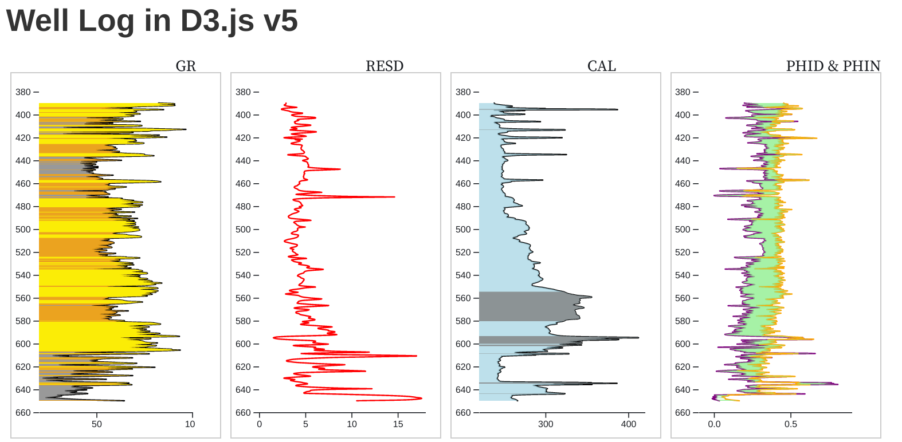

# wellio_Viz.js
d3.js v5 visualization sister repo for wellio.js

## IN PROGRESS.....

### Docs will be here: https://justingosses.github.io/wellioviz/

### Organization of Issues on Kanban board here: https://github.com/JustinGOSSES/wellioviz/projects/1

### Building a basic demo here: https://justingosses.github.io/wellioviz/demo.html

This is the wellio demo but with the visualization going to be rebuilt with wellioviz. Currently only using the bare minimum of wellioviz but will build more in as time goes on.... Currently using a single fill for all curveNames, Xmas themed colors.

### MOST RECENT OBSERVABLE DEMO IS: https://observablehq.com/@justingosses/well-log-in-d3-js-v5-notebook-2

##### Other older Observable notebooks from earlier brainstorms are:
https://observablehq.com/@justingosses/well-log-in-d3-js-v5

&

https://observablehq.com/@justingosses/overly-simplified-stratigraphic-modeling

&

https://observablehq.com/@justingosses/well-log-curve-cross-sections

## Why

Most geologists who make charts of well logs via code seem to do so in Python, often working in Jupyter notebooks. Very often, they will use matplotlib. There are other potential places and reasons you might need code-created plots of well logs, that matplotlib doesn't work great for. For many of these use-cases, a JavaScript based approach to plotting well logs makes more sense.

1. <b>Websites that provide well logs in LAS format to audiences on the web.</b> Storing PNGs created with matplotlib is less than ideal as all the images have to be greated, stored, and loaded before the user needs them. This takes a lot of storage space.
2. <b>GUIs for well correlation.</b> This could be web-based or built with web tools but running locally. Currently, there really isn't a free open-source application for well log correlation, at least to the best of my knowledge. This means if you don't have Enterprise scale money, (academics, non-profits, hobbyest, students, people in between jobs, etc.) you're often limited to correlating a handfull of wells at most using paper and pencil. 
3. <b>Interactive plotting for visualization within notebook environment.</b> Matplotlib is very limited in terms of true interactivity. JavaScript visualizations running in a Jupyter notebook otherwise runnning Python offer more flexibility and power for interactive visualizations than many Python visualizations libraries that are often just wrappers for a portion of a JavaScript library. Swapping out curves, changes appearance, applying thresholds to how things are depicted, and adding tops or other types of annotation can be more easily built into easy to use GUIs if JavaScript is used for visualization instead of Python tooling.

<i>Point of Caution: The last two are going to be pretty hard to build well and are out of scope of this project.</i>

## Visualization Boxes
- Curvebox: Single Curve (single well)
- Curvebox: Multiple Curves (single well)
- CurveboxHolder: Single Well (single or multiple curve per box all from single well)
- CurveboxHolder: Multiple Well (single or multiple curve per box all from multiple well) AKA Cross-Section

## Possible Visualization Pieces
- Axis
- Curvebox Title
- Axis titles
- *Scales, and scale title with units*
- Curves
- Curve fill based on under or over a curve 
- Curve fill multiple fill colors based on cutoffs & under or over a curve value
- Curve fill based on overlap of two curves
- Curve fill based on SVG pattern
- Curve fill like property but visualized as curve line color
- Curve fill like property but visualized as colored rectangle within well box or curve box.
- Top lines
- Top lines between well boxes
- Top titles

## Potential API organization brainstorm:
- Central point of organizatin for API is curvebox.
- Each curvebox is built from JSON template. This enables default values to be used most of the time and new values to be easiely substituted via template.key = something calls. This will supply data, text, and styling choices for each curve box. instead of calling d3.js code directly, inputs will be supplied via the template. 
- There are multiple options for combining curveboxes. At this time, it looks like the most flexible will be to intiate a html div with an given ID, then append SVGs to that div. Each curvebox is created and appended separately as a separate div. 
- Curvebox template will cover everything except: multi-curvebox title, top lines between curve boxes, [width, height, padding, margins, etc] or div that the SVGs get appended to. 
- Initial template is used with good defaults. 
- 1. For single curve single well, only thing that must be changed is well-name, curveName, curve data. 
- 2. For multiple curve + single well + single curvebox all that needs to be changed is the same as before but two curve names and maybe fill parameter if fill is wanted.
- 3. For single curve multiple wells, an array of curveNames acceptable in order or preference, multiple wellio JSON datas objects is all that is required at minimum. 
- 4. If tops are wanted in the above option for a cross-section, then an object with top name and array of top depths for each well name or `None` must be given which will be used to plot tops. Multiple such objects can be provided.

### Architecture Sketch

## Theoretical Development Plan
- Play around with it could be on Observable. 
- Explore different potential ways to organize the code
- Build it into a vanilla front-end and node.js package when it is clear how API should work.
- Deploy to npm. 
- Build into production use-cases in a couple of different ways
