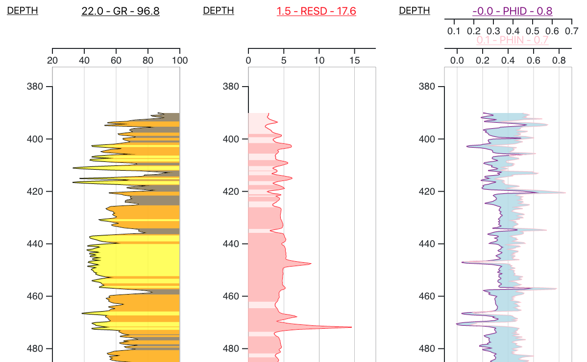
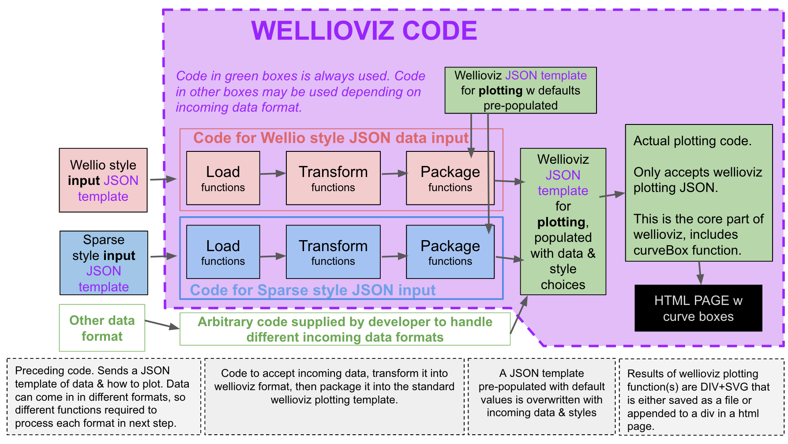

# wellio_Viz.js

WELLIOVIZ is a JavaScript library that provides functionality to visualize well logs, particularly those already converted to JSON, using the d3.js visualization library.

## IT IS IN PROGRESS.....

## Demos & Examples

#### 1.More Recent Obserevable-Notebook-Based Demo
- ##### LOOK AT THIS ONE TO SEE CURRENT CODE: https://observablehq.com/@justingosses/well-log-in-d3-js-v5-notebook-2
- Status: Up to date
- Link: <a href="https://observablehq.com/@justingosses/well-log-in-d3-js-v5-notebook-2">here</a>

#### 2. HTML demo as github pages page in this repository
- Status: Out of date
- Link: Building a basic demo here: https://justingosses.github.io/wellioviz/demo.html <---- THIS IS OUT OF DATE
- This is the wellio demo but with the visualization going to be rebuilt with wellioviz. Currently only using the bare minimum of wellioviz but will build more in as time goes on.... uses an older version of index.js than in this repo...will update to current eventually... in progress

#### 3. Alterative Observable-notebook-based demos out of date
- Status: Way out of date!
- Link: Other older Observable notebooks that use older versions of wellioviz code but give further idea what is possible are: 
- https://observablehq.com/@justingosses/well-log-in-d3-js-v5
- https://observablehq.com/@justingosses/overly-simplified-stratigraphic-modeling
- https://observablehq.com/@justingosses/well-log-curve-cross-sections

## Why?

Most geologists who make charts of well logs via code seem to do so in Python, often working in Jupyter notebooks. Very often, they will use matplotlib. There are other potential places and reasons you might need code-created plots of well logs, that matplotlib doesn't work great for. For many of these use-cases, a JavaScript based approach to plotting well logs makes more sense.

1. <b>Websites that provide well logs in LAS format to audiences on the web.</b> Storing PNGs created with matplotlib is less than ideal as all the images have to be created, stored, and loaded before the user needs them. This takes a lot of storage space.
2. <b>GUIs for well correlation.</b> This could be web-based or built with web tools but running locally. Currently, there really isn't a free open-source application for well log correlation, at least to the best of my knowledge. This means if you don't have Enterprise scale money, (academics, non-profits, hobbyest, students, people in between jobs, etc.) you're often limited to correlating a handfull of wells at most using paper and pencil. 
3. <b>Interactive plotting for visualization within notebook environment.</b> Matplotlib is very limited in terms of true interactivity. JavaScript visualizations running in a Jupyter notebook otherwise runnning Python offer more flexibility and power for interactive visualizations than many Python visualizations libraries that are often just wrappers for a portion of a JavaScript library. Swapping out curves, changes appearance, applying thresholds to how things are depicted, and adding tops or other types of annotation can be more easily built into easy to use GUIs if JavaScript is used for visualization instead of Python tooling.

<i>Point of Caution: The last two are out of scope of this project. Wellioviz is built with the concept that those are possible ways wellioviz could be used.</i>

## Architecture 

For more information on how wellioviz is organized, check out the <a href="ARCHITECTURE.MD">ARCHITECTURE.MD</a> document. 

## DOCS
Docs will be here: https://justingosses.github.io/wellioviz/ They are only partially up to date currently. 

## Contributing
Check out the Contributing <a href="https://github.com/JustinGOSSES/wellioviz/blob/master/CONTRIBUTING.md">Guidelines</a>. Issues, documentation, pull requests, examples, test cases, and questions needed!

## <a href="CODE_OF_CONDUCT.md">Code of Conduct</a>

#### Organization of Issues on Kanban board here: https://github.com/JustinGOSSES/wellioviz/projects/1

### Theoretical Development Plan...
- Build on Observable and sync to index.js file inside the dist folder.
- Build stand alone demos and test in other non-Observable environments.
- Build it into a vanilla front-end and node.js package.
- Deploy to npm. 
- Build several examples of production use-cases.

#### Further Thinking...

<a href="docs/BRAINSTORMS.md">BRAINSTORM.md</a>
<a href="docs/audiences.md">AUDIENCES.md</a>
